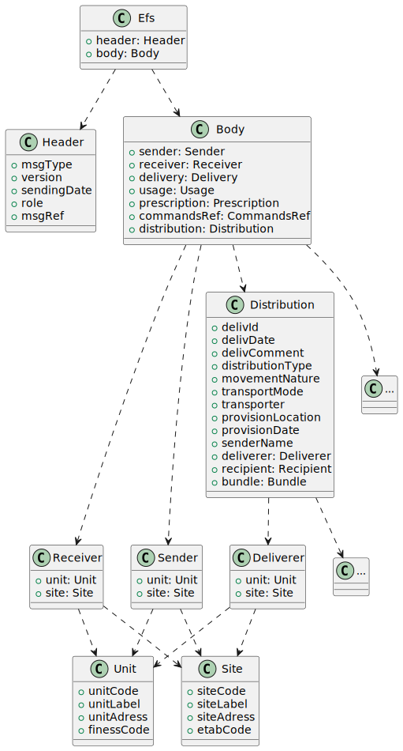

NF S97 : Traçabilité des produits sanguins labiles
==================================================

== Introduction
les normes NF S97 homologuées par AFNOR définissent une structure de données d'échange dans le cadre de la traçabilité des produits sangins labiles :
- NF S97-530 Novembre 2010 Informatique de santé - Messages concernant la transfusion sanguine - Modèle de communication et de données.
- NF S97-531 Novembre 2010 Informatique de santé - Messages concernant la transfusion sanguine - Message de délivrance de produits sanguins labiles et de retour sur délivrance.
- NF S97-532 Novembre 2010 Informatique de santé - Messages concernant la transfusion sanguine - Message de distribution de produits sanguins labiles.
- NF S97-536 Novembre 2010 Informatique de santé - Messages concernant la transfusion sanguine - Message de prescription de produits sanguins labiles.

== Parser/Serializer
Le projet `nf-s97` fourni un parseur et un sérialiseur permetant de décoder ou encoder les différents messages définis par les normes NF S97.

Le parseur retourne un objet conforme au modèle défini dans le package `fr.aphp.nf.s97.model`.

Le sérialiseur fait l'opération inverse.

=== Limitations
- Tous les champs non structurés (Valeurs) sont de type `String`.
- Il n'y a pas de vérification de format, ex: Date YYmmdd 
- Il n'y a pas de vérification de longueur, ex: le champs définit dans la norme par "af - Type de message 	A15	O" doit être aphabétique de longueur 15
- Il n'y a pas de vérification du caractère obligatoire des champs
- Il n'y a pas de vérification du nombre d'occurence minimal sur les champs répétables
- Il n'y a pas de vérification des liste de valeurs.

Un document NF S97 est transformé en objet `Efs.class` en reproduisant toutes ses non conformités s'il y en a.

Cela permet d'obtenir un objet même s'il y a des non conformités

Cela implique qu'il est du ressort du consomateur de l'objet de s'assurer qu'il est valide.

== Converter
Le projet `nf-s97-converter` fourni un `Converter` pour être utilisé dans le framework d'intégration `Camel`.

.route camel
[source,java]
----
            DataFormat jckDF = new JacksonDataFormat (Efs.class);
            from("netty:https://0.0.0.0:8443/rdl?httpMethodRestrict =PUT")
            .unmarshal(jckDF)
            .process(new Validator())
            .convertBodyTo(String.class)
            .to("sftp://efs-server/exchange");
----
Exemple de route `camel` qui expose un service sur le port `8443` qui accepte avec la méthode `POST` des palyload `Efs.class` au format `JSON`
les convertis en objets, assure la vérification avant de les envoyer au format afnor `NF S97` au serveur `sftp` de l'efs.

Le converter `Efs.class` => `String.class` est automatiquement détécté par camel lors de la création de la partie de la route correspondant à `.convertBodyTo(String.class)`.

